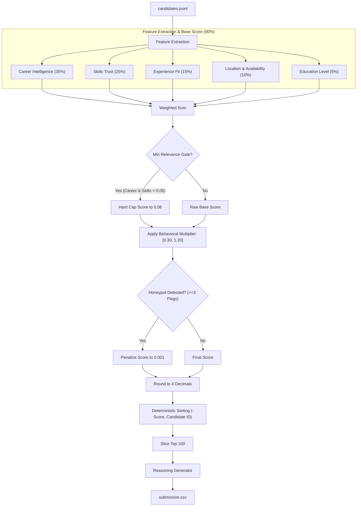

# Redrob Intelligent Candidate Discovery & Ranking — INDIARUNS

A CPU-only, zero-network, <5-minute candidate ranker for the **Senior AI Engineer (Founding Team)** role at Redrob AI.

## Architecture

```
candidates.jsonl (100K)
    → Feature Extraction (career / skills / experience / location / education)
    → Behavioral Multiplier (platform engagement signals)
    → Honeypot Detection (timeline impossibility, expert+zero-duration)
    → Composite Score
    → Top 100 Ranked with Per-Candidate Reasoning
    → submission.csv
```

### Scoring Formula

```
score = (
    0.35 × career_score        # IR/ranking/search career evidence
  + 0.25 × skills_score        # Relevant skills × proficiency × duration × endorsements
  + 0.15 × experience_score    # YOE band fit + product company ratio
  + 0.10 × location_score      # India Tier-1 cities + notice period
  + 0.05 × education_score     # CS/ML degree × institution tier
) × behavioral_multiplier      # [0.30, 1.20] based on activity / responsiveness
```

Honeypots are penalized to score ≈ 0.001 (effectively evicted from top 100).

## Detailed Algorithm Walkthrough

The ranking engine processes candidates in a multi-stage streaming pipeline to compute deterministic ranks.



### 1. Feature Extraction & Domain Scoring (Additive Base Score)
The base score is computed using five weighted scoring modules defined in the `scorer/` package:

| Component | Weight | Key Heuristics & Scoring Mechanics |
| :--- | :--- | :--- |
| **Career Intelligence** ([career.py](file:///e:/Hackathons/INDIARUNS/scorer/career.py)) | **35%** | • Uses pre-compiled regex patterns to scan headlines, summaries, and role descriptions for Search/IR (Tier 1), ML/NLP (Tier 2), and general Backend/CS (Tier 3) keywords.<br>• Applies a **consulting penalty** (up to -0.35) if the candidate's career is dominated by service-only firms (e.g., TCS, Infosys, Accenture).<br>• Grants **product engineering bonuses** (up to +0.15) for experience in small/mid-sized product companies (sizes 1–1000).<br>• Checks for **production scale** signals (e.g., "deployed", "scale", "live users") and current title relevance. |
| **Skills Trust** ([skills.py](file:///e:/Hackathons/INDIARUNS/scorer/skills.py)) | **25%** | • Scores skills based on a JD-specific taxonomy categorized into `MUST_HAVE`, `NICE_TO_HAVE`, and `RED_FLAG`.<br>• Uses the trust weight formula: $\text{relevance} \times \text{proficiency\_weight} \times \log(\text{duration\_months} + 1) \times \log(\text{endorsements} + 2)$.<br>• Integrates **verification bonuses** (up to 1.25x per skill) from Redrob skill assessments if scores are high, and applies penalties for red-flag skills (e.g., Photoshop, Civil Eng). |
| **Experience Fit** ([experience.py](file:///e:/Hackathons/INDIARUNS/scorer/experience.py)) | **15%** | • Maps total years of experience against the ideal JD range of **5 to 9 years** using a smooth fitness curve (reaching 1.0 at 5-9 years, declining for over/under-experience).<br>• Checks for leadership/management bloat: applies a penalty if current titles indicate pure management or architecture without hands-on IC coding roles (e.g., VP, CTO, Director). |
| **Location & Availability** ([location.py](file:///e:/Hackathons/INDIARUNS/scorer/location.py)) | **10%** | • Evaluates city/country relevance: scores 1.0 for preferred cities (Noida, Pune, Hyderabad, Mumbai, Delhi/NCR, Bangalore) and factors in relocation willingness for Tier-1 cities.<br>• Adjusts for availability via notice period modifier (bonus for ≤30 days, penalty for >90 days). |
| **Education Level** ([education.py](file:///e:/Hackathons/INDIARUNS/scorer/education.py)) | **5%** | • Checks degree level (Ph.D./M.Tech bonus) and field of study relevance (CS/ML/AI/math vs. unrelated fields).<br>• Weights the degree based on the institution tier (Tier 1 to Tier 4). |

### 2. Minimum Relevance Gate
To prevent off-domain candidates (e.g., Civil Engineers, Accountants, HR Managers) with high location or education scores from creeping into the ranking, a hard gate is applied:
* If both **Career Score** and **Skills Score** are `< 0.05`, the final score is hard-capped at **0.08**. This guarantees off-domain profiles never enter the top 100.

### 3. Behavioral Multiplier (Multiplicative Engagement)
A candidate's base score is multiplied by an engagement factor in the range `[0.30, 1.20]`:
$$\text{Final Score} = \min(1.0, \text{Base Score} \times \text{Behavioral Multiplier})$$
The multiplier combines:
* **Recency**: Penalizes inactive candidates (e.g., 0.45x penalty if inactive >365 days).
* **Responsiveness**: Bonus for high recruiter response rates (up to 1.10x), penalty for low response rates.
* **Intent**: Bonus for open-to-work flag, active job searches, and high interview completion rates.
* **Validation**: Bonus for GitHub activity and profiles saved by recruiters.

### 4. Honeypot Detection (Eviction System)
Honeypots with subtly fabricated profiles are identified in [honeypot.py](file:///e:/Hackathons/INDIARUNS/scorer/honeypot.py) using a multi-flag heuristic system. If a candidate triggers **$\ge 3$ flags**, they are classified as a honeypot and penalized to a near-zero score (**0.001**), effectively evicting them:
1. **Expert with Zero Duration**: Flagged if $\ge 3$ skills are listed as "expert" with `duration_months = 0`.
2. **Suspicious Endorsements**: Flagged if the candidate has $\ge 10$ expert skills with an average of $> 60$ endorsements.
3. **Timeline Impossibility**: Flagged if total claimed career months is $> 2\times$ the elapsed time since college graduation.
4. **Implausible Dates**: Flagged if a role started before 1985 or if a single role duration exceeds 25 years.
5. **Over-perfection**: Flagged if the candidate has $\ge 15$ skills and 100% of them are at "expert" level.

### 5. Selection and Tie-Breaking
1. Final scores are rounded to 4 decimal places (`round(score, 4)`).
2. The candidates are sorted using a multi-key sort in [rank.py](file:///e:/Hackathons/INDIARUNS/rank.py):
   - Primary: Rounded score descending (`-score_rounded`)
   - Secondary: Candidate ID alphabetically ascending (`candidate_id`)
3. The top 100 candidates are sliced.
4. A rule-based reasoning generator ([reasoning.py](file:///e:/Hackathons/INDIARUNS/reasoning.py)) analyzes their attributes to output a factual, non-hallucinated justification for the candidate's rank and score in `submission.csv`.

## Quick Start

### Prerequisites
```bash
# Python 3.10+ required
python --version

# Install dependencies (only pandas, for --debug mode)
pip install -r requirements.txt
```

### Run Ranking
```bash
python rank.py \
  --candidates ./candidates.jsonl \
  --out ./submission.csv
```

### Validate Submission
```bash
python "[PUB] India_runs_data_and_ai_challenge/[PUB] India_runs_data_and_ai_challenge/India_runs_data_and_ai_challenge/validate_submission.py" \
  --submission ./submission.csv \
  --candidates ./candidates.jsonl
```

## File Structure

```
INDIARUNS/
├── rank.py                    # Main entrypoint
├── reasoning.py               # Per-candidate reasoning generator
├── scorer/
│   ├── __init__.py
│   ├── career.py              # Career intelligence score (0.35)
│   ├── skills.py              # Skills trust score (0.25)
│   ├── experience.py          # Experience fit score (0.15)
│   ├── location.py            # Location + notice period score (0.10)
│   ├── education.py           # Education score (0.05)
│   ├── behavioral.py          # Behavioral multiplier
│   └── honeypot.py            # Honeypot detection
├── requirements.txt
├── submission_metadata.yaml
└── README.md
```

## Design Decisions

### Why not keyword counting?
The sample submission (provided as a "bad example") ranks HR Managers and Accountants #1-3 because they have many AI keywords. Our `career.py` scorer weights keywords in context — appearing in a role description for an ML/search system is worth far more than appearing in a skills list.

### Why multiplicative behavioral modifier?
A candidate with perfect skills who hasn't logged in for 6 months and has a 5% recruiter response rate is not actually hirable. Down-weighting them multiplicatively (not just additively) ensures they don't appear in our top 100 even if their profile is otherwise excellent.

### How do we avoid honeypots?
Two main signals:
1. `proficiency = "expert"` + `duration_months = 0` → impossible — expert at a skill you've never used
2. Career timeline impossibility — total claimed experience months > months since graduation

### Runtime
- Runtime: ~60-90s on CPU (well within 5-minute budget) for 100K candidates
- No pre-computation required
- No network required during ranking

## Compute Environment
- Python 3.11, CPU only, no GPU
- No external API calls during ranking
- Memory: ~2 GB peak for 100K candidates (profile data is held in memory only briefly)

## Reproduction (Stage 3)
```bash
python rank.py --candidates ./candidates.jsonl --out ./submission.csv
```
This single command produces the submission CSV from scratch. Runtime ≤ 5 minutes on any 16 GB CPU machine.
